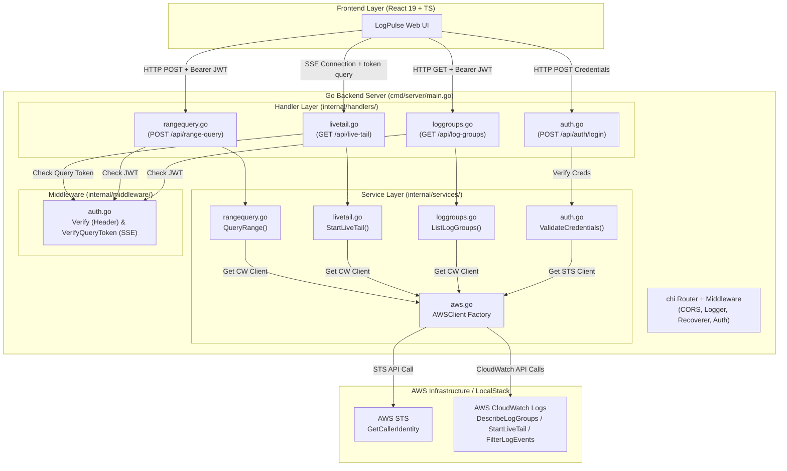
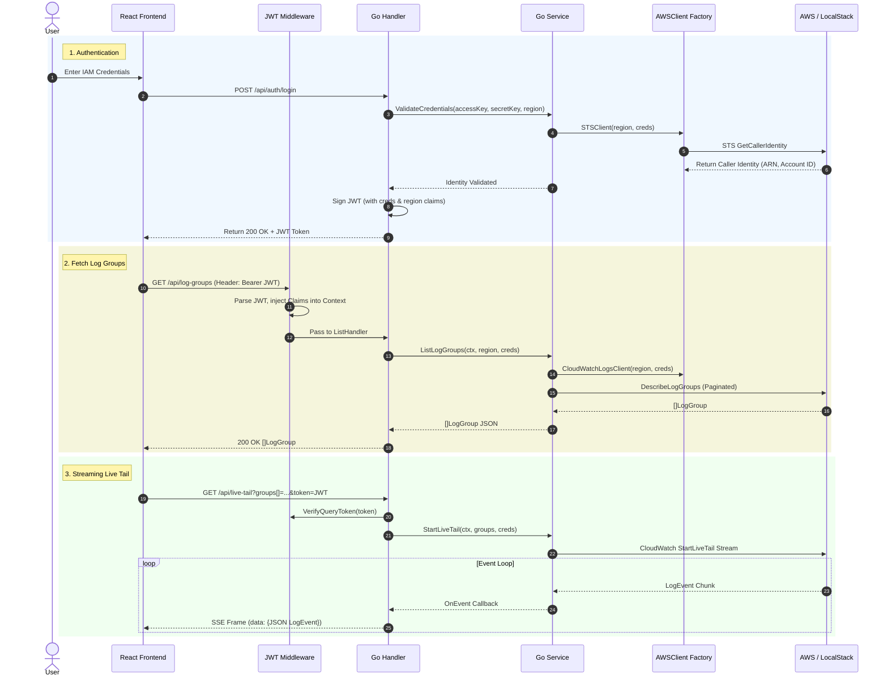

# LogPulse Go Backend Architecture & Schematic

This document outlines the architecture, layer separation, data flow, and AWS SDK integration for the **LogPulse** Go backend.

---

## 🏛 High-Level Architecture Diagram



---

## 🔄 End-to-End Data Flow



---

## 🛠 Directory & Layer Responsibilities

```
backend/
├── cmd/
│   └── server/
│       └── main.go           # Entry point: loads env, sets up chi router, mounts routes
├── internal/
│   ├── handlers/             # HTTP Layer (Decodes JSON body/query, handles status codes)
│   │   ├── auth.go           # POST /api/auth/login
│   │   ├── loggroups.go      # GET /api/log-groups
│   │   ├── livetail.go       # GET /api/live-tail (SSE)
│   │   └── rangequery.go     # POST /api/range-query
│   ├── middleware/           # Cross-cutting Concerns
│   │   └── auth.go           # JWT verification & claims context extraction
│   └── services/             # Core Business Logic & AWS Integration
│       ├── aws.go            # AWS SDK Client Factory (handles LocalStack endpoint overrides)
│       ├── auth.go           # Validates IAM credentials with STS GetCallerIdentity
│       ├── loggroups.go      # Interacts with CloudWatch DescribeLogGroups API
│       ├── livetail.go       # Manages CloudWatch StartLiveTail streaming connection
│       └── rangequery.go     # Queries historical logs via FilterLogEvents API
├── go.mod                    # Go 1.24 module definition
└── .env.example              # Environment variables template
```

---

## 💡 How the AWS Client Factory Works

The `AWSClient` struct in `internal/services/aws.go` acts as a centralized factory. Whenever a service needs to talk to AWS:

1. It passes the user's specific `region`, `accessKeyID`, and `secretAccessKey` extracted from their authenticated JWT token.
2. The factory creates an AWS SDK v2 client scoped specifically to that user's session.
3. If `AWS_ENDPOINT` is configured in the environment (e.g. `http://localhost:4566`), it sets `BaseEndpoint` on the client options to redirect all AWS traffic directly into LocalStack!
